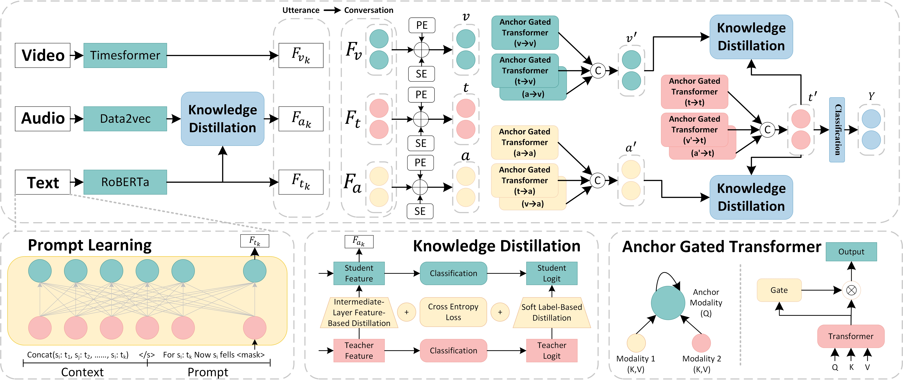

# MAGTKD
Jie Li, Shifei Ding, Lili Guo, and Xuan Li, "Multi-modal Anchor Gated Transformer with Knowledge Distillation for Emotion Recognition in Conversation". (IJCAI 2025, Pytorch Code)

## Abstract
Emotion Recognition in Conversation (ERC) aims to detect the emotions of individual utterances within a conversation. Generating efficient and modality-specific representations for each utterance remains a significant challenge. Previous studies have proposed various models to integrate features extracted using different modality-specific encoders. However, they neglect the varying contributions of modalities to this task and introduce high complexity by aligning modalities at the frame level. To address these challenges, we propose the Multi-modal Anchor Gated Transformer with Knowledge Distillation (MAGTKD) for the ERC task. Specifically, prompt learning is employed to enhance textual modality representations, while knowledge distillation is utilized to strengthen representations of weaker modalities. Furthermore, we introduce a multi-modal anchor gated transformer to effectively integrate utterance-level representations across modalities. Extensive experiments on the IEMOCAP and MELD datasets demonstrate the effectiveness of knowledge distillation in enhancing modality representations and achieve state-of-the-art performance in emotion recognition. Our code is available at: https://github.com/JieLi-dd/MAGTKD.

<picture>

</picture>

## Requirements
The following pretrained models are used for feature extraction from the three modalities:
1. Text Modality: [RoBERTa-large](https://huggingface.co/FacebookAI/roberta-large)
2. Audio Modality: [data2vec-audio-base-960h](https://huggingface.co/facebook/data2vec-audio-base-960h)
3. Video Modality: [Videomae-base and](https://huggingface.co/MCG-NJU/videomae-base) and 
[Timesformer-base-finetuned-k400](https://huggingface.co/facebook/timesformer-base-finetuned-k400)

Python environment dependencies:
```
python==3.9.19
torch==1.13.1+cu116
torchvision==0.14.1+cu116   
torchaudio==0.13.1+cu116
transformers==4.27.2
```


## Datasets
We use two widely adopted ERC datasets:
1. [IEMOCAP](https://sail.usc.edu/iemocap/iemocap_release.htm)
2. [MELD](https://github.com/declare-lab/MELD/)

In the first stage, modality-specific features are extracted via knowledge distillation. You may download and use the pre-extracted features provided below.
```
原始特征放入到下面的文件夹中：
Project
| - datasets
    | - IEMOCAP
        | - IEMOCAP_train.csv
        | - IEMOCAP_dev.csv
        | - IEMOCAP_test.csv
        | - Session1
        ...
    | - MELD
        | - train_meld_emo.csv
        | - dev_meld_emo.csv
        | - test_meld_emo.csv
        | - dev_splits_complete
        | - train_splits
        | - output_repeated_splits_test
        ...
| - pretrained_model
    | - roberta-large
    | - data2vec-audio-base-960h
    | - timesformer-base-finetuned-k400
    | - videomae-base
| - IEMOCAP
    | - feature
        | - video
            | - train
            | - dev
            | - test
    | - IEMOCAP
        | - save_model
            | - text.bin
            | - audio.bin
            | - video.bin
            | - text_KD_audio.bin
            | - video_KD_text.bin
    | - model.py
    | - utils.py
    | - preprocessing.py
    | - dataset.py
    | - text.py
    | - audio.py
    | - video.py
    | - video_feature_extract.py
    | - KD.py
| - MELD
```

## Train and test
To train from scratch on the IEMOCAP dataset:
```
# 1. Extract text features
python text.py  

# 2. Extract audio features
python audio.py  

# 3. Extract raw video features
python video_feature_extract.py  

# 4. Process video features
python video.py  

# 5. Perform knowledge distillation (audio student, text teacher)
python KD.py --student audio --teacher text  

# 6. Perform knowledge distillation (video student, text teacher)
python KD.py --student video --teacher text  

# 7. Extract fused features from all modalities (first stage)
python extract_first_stage_features.py  

# 8. Perform multimodal fusion training and testing
python multimodal_fusion.py
```

**For the MELD dataset:**
The directory structure and training process are the same as for IEMOCAP.

**To run testing only:**
Please first download and place the distilled first-stage features into the corresponding dataset folders:
1. [Baidu Netdisk](https://pan.baidu.com/s/1t3Y1jdWgMXqhCkaT6gB1ww?pwd=dzz5),
2. [Google Drive]()

Then run:
```
python multimodal_fusion.py --train True
```

## Citation
If you find our work useful, please consider citing the following papers:
```
@inproceedings{song-etal-2022-supervised,
    title = "Supervised Prototypical Contrastive Learning for Emotion Recognition in Conversation",
    author = "Song, Xiaohui  and
      Huang, Longtao  and
      Xue, Hui  and
      Hu, Songlin",
    booktitle = "EMNLP",
    year = "2022",
    pages = "5197--5206",
}
@inproceedings{yun-etal-2024-telme,
    title = "{T}el{ME}: Teacher-leading Multimodal Fusion Network for Emotion Recognition in Conversation",
    author = "Yun, Taeyang  and
      Lim, Hyunkuk  and
      Lee, Jeonghwan  and
      Song, Min",
    booktitle = "NAACL",
    year = "2024",
    pages = "82--95",
}
@ARTICLE{10109845,
  author={Ma, Hui and Wang, Jian and Lin, Hongfei and Zhang, Bo and Zhang, Yijia and Xu, Bo},
  journal={IEEE Transactions on Multimedia}, 
  title={A Transformer-Based Model With Self-Distillation for Multimodal Emotion Recognition in Conversations}, 
  year={2024},
  volume={26},
  number={},
  pages={776-788},
}
```


## Acknowledgement
Our method builds upon the implementations of the following projects:
1. [SPCL](https://github.com/caskcsg/spcl)
2. [TelME](https://github.com/yuntaeyang/TelME)
3. [SDT](https://github.com/butterfliesss/SDT)

We thank the authors of these works for sharing their codebases.